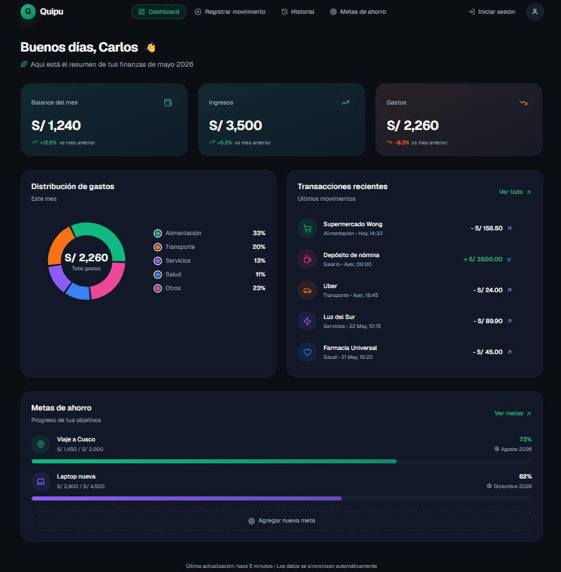
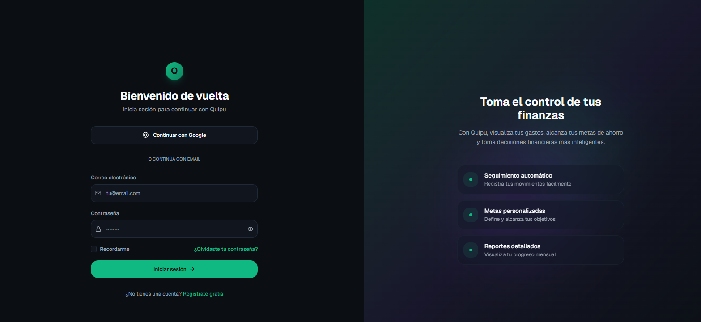
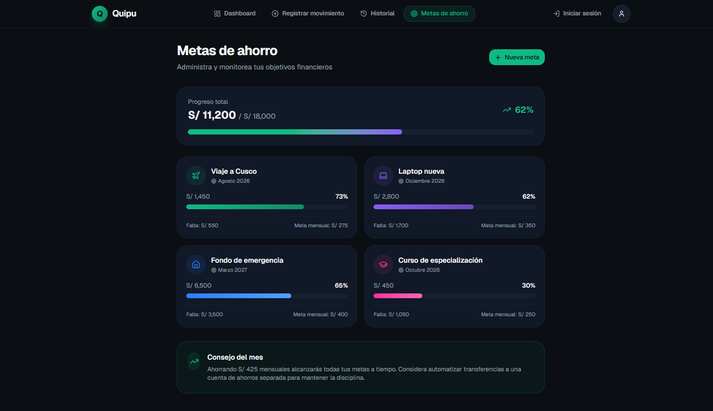

# Documento de Diseño de Interfaces
## Quipu — Aplicación Web de Finanzas Personales con IA

| Campo | Detalle |
|-------|---------|
| **Versión** | 1.0.0 |
| **Estado** | En revisión |
| **Fecha** | Mayo 2026 |
| **Metodología** | SDD (Software Design Document) — Fase D |

### Historial de Versiones

| Versión | Fecha | Descripción |
|---------|-------|-------------|
| 1.0.0 | Mayo 2026 | Versión inicial del documento |

---

## Tabla de Contenidos

1. [Principios de Diseño](#1-principios-de-diseño)
2. [Sistema de Diseño](#2-sistema-de-diseño)
3. [Arquitectura de Navegación](#3-arquitectura-de-navegación)
4. [Wireframes por Pantalla](#4-wireframes-por-pantalla)
   - [P-001 — Login / Registro](#p-001--login--registro)
   - [P-002 — Dashboard Principal](#p-002--dashboard-principal)
   - [P-003 — Registrar Movimiento](#p-003--registrar-movimiento)
   - [P-004 — Historial de Movimientos](#p-004--historial-de-movimientos)
   - [P-005 — Metas de Ahorro](#p-005--metas-de-ahorro)
5. [Componentes Reutilizables](#5-componentes-reutilizables)
6. [Estados de Interfaz](#6-estados-de-interfaz)
7. [Trazabilidad con Casos de Uso](#7-trazabilidad-con-casos-de-uso)

---

## 1. Principios de Diseño

El diseño de Quipu se fundamenta en cuatro principios que guían cada decisión visual e interactiva:

| Principio | Descripción |
|-----------|-------------|
| **Claridad** | La información financiera debe leerse de un vistazo. Jerarquía visual clara: balance > distribución > detalle. |
| **Inmediatez** | El registro de un movimiento debe completarse en menos de 30 segundos. El flujo NLP reduce la fricción al mínimo. |
| **Confianza** | El dinero exige precisión. Colores semánticos consistentes (verde = ingreso, rojo/naranja = gasto), sin ambigüedades. |
| **Accesibilidad** | Diseño responsivo mobile-first. Contraste de color mínimo WCAG AA. Formularios utilizables en pantalla táctil. |

---

## 2. Sistema de Diseño

### 2.1 Paleta de Colores

| Rol | Color | Hex | Uso |
|-----|-------|-----|-----|
| Primario | Verde teal | `#1D9E75` | Acciones principales, ingresos, barras de progreso |
| Primario claro | Verde suave | `#9FE1CB` | Estados secundarios, progreso alternativo |
| Primario fondo | Verde muy claro | `#E1F5EE` | Fondos de tarjetas IA, badges de ingreso |
| Alerta gasto | Naranja coral | `#D85A30` | Montos de gastos, alertas de gasto elevado |
| Alerta fondo | Coral claro | `#FAECE7` | Fondos de badges de gasto |
| Neutro oscuro | Gris cálido | `#2C2C2A` | Texto principal |
| Neutro medio | Gris medio | `#888780` | Texto secundario, labels |
| Superficie | Blanco | `#FFFFFF` | Fondo de tarjetas |
| Fondo | Gris muy claro | `#F1EFE8` | Fondo general de la aplicación |

### 2.2 Tipografía

| Elemento | Tamaño | Peso | Uso |
|----------|--------|------|-----|
| Logo | 28px | 500 | Nombre de la app en header |
| Título de sección | 15px | 500 | Encabezados de módulos |
| Cuerpo principal | 14px | 400 | Contenido general, nombres de movimientos |
| Labels | 12–13px | 400 | Etiquetas de campos, fechas, categorías |
| Montos | 20–22px | 500 | Cifras destacadas en dashboard |
| Micro-texto | 11–12px | 400 | Metadata, hints, contadores |

### 2.3 Componentes Base

**Botón primario:**
- Fondo `#1D9E75`, texto blanco, radio `8px`, padding `10px 20px`
- Ancho completo en formularios, ancho automático en acciones puntuales

**Botón secundario (outline):**
- Borde `0.5px solid`, fondo transparente, texto secundario
- Usado para acciones de editar, eliminar, cancelar

**Tarjeta (card):**
- Fondo blanco, borde `0.5px solid`, radio `12px`, padding `1rem 1.25rem`
- Sombra ausente (diseño plano)

**Campo de entrada:**
- Alto 40px, borde `0.5px solid`, radio `8px`
- Estado focus: borde `#1D9E75`
- Estado error: borde `#D85A30` + mensaje inline en rojo

**Badge de categoría:**
- Fondo tonal de la categoría, radio `999px` (pastilla)
- Verde para ingresos, naranja para gastos, gris para neutros

**Barra de progreso:**
- Fondo `#E1F5EE` (gris verdoso suave), relleno `#1D9E75`
- Alto `8px`, radio `4px`

---

## 3. Arquitectura de Navegación

```
/                    → Redirige a /login si no autenticado
/login               → P-001 (tab: iniciar sesión)
/register            → P-001 (tab: registrarse)
/dashboard           → P-002 ← ruta principal post-login
/movimientos/nuevo   → P-003
/movimientos         → P-004
/movimientos/:id     → Modal de detalle sobre P-004
/metas               → P-005
/perfil              → Pantalla de perfil (P-006, fuera del alcance visual de este doc)
```

**Barra de navegación lateral (desktop, ≥1024px):**

```
⊕ Quipu
─────────────────
🏠 Dashboard
↕  Movimientos
🎯 Metas
👤 Perfil
─────────────────
⎋  Cerrar sesión
```

**Barra inferior (móvil, <768px):**
Íconos sin texto: Dashboard · Movimientos · Metas · Perfil

---

## 4. Wireframes por Pantalla

---

### P-001 — Login / Registro

**CU relacionados:** CU-001 (Registrar Usuario), CU-002 (Iniciar Sesión)

**Descripción:** Punto de entrada de la aplicación. Pantalla centrada con logo, sistema de tabs para alternar entre login y registro, y formulario dinámico según el tab activo.

**Estructura visual:**

```
┌─────────────────────────────────────────┐
│                                         │
│           ⊕  Quipu                      │
│        Tus finanzas, en orden           │
│                                         │
│  ┌──────────────┬──────────────┐        │
│  │ Iniciar sesión│  Registrarse │        │
│  └──────────────┴──────────────┘        │
│                                         │
│  Correo electrónico                     │
│  ┌─────────────────────────────────┐    │
│  │ maria@ejemplo.com               │    │
│  └─────────────────────────────────┘    │
│                                         │
│  Contraseña                             │
│  ┌─────────────────────────────────┐    │
│  │ ••••••••               👁       │    │
│  └─────────────────────────────────┘    │
│                                         │
│             ¿Olvidaste tu contraseña?   │
│                                         │
│  ┌─────────────────────────────────┐    │
│  │        Iniciar sesión           │    │
│  └─────────────────────────────────┘    │
│                                         │
│   ¿No tienes cuenta? Regístrate aquí    │
│                                         │
│  [ Datos seguros · JWT + bcrypt ]       │
│                                         │
└─────────────────────────────────────────┘
```

**Tab "Registrarse" agrega los campos:**
- Nombre completo
- Correo electrónico
- Contraseña
- Confirmar contraseña

**Validaciones visibles:**
- Correo: formato inválido → mensaje inline "Ingresa un correo válido"
- Contraseña: <8 caracteres → "Mínimo 8 caracteres"
- Contraseñas no coinciden → "Las contraseñas no coinciden"
- Correo ya registrado → toast rojo "Este correo ya está en uso"

**Estados de carga:**
- Botón muestra spinner y se deshabilita durante la petición

---

### P-002 — Dashboard Principal

**CU relacionados:** CU-014 (Ver Dashboard Principal), CU-021 (Resumen de Metas)

**Descripción:** Vista central de la aplicación. Presenta el resumen financiero del mes, la distribución de gastos por categoría, los movimientos más recientes y un resumen de hasta 3 metas activas.

**Estructura visual:**

```
┌─────────────────────────────────────────────────────────┐
│  ⊕ Quipu                          [👤] María Quispe ▾  │
├─────────────────────────────────────────────────────────┤
│                                                         │
│  ┌──────────────┐ ┌──────────────┐ ┌──────────────┐    │
│  │ Balance mes  │ │   Ingresos   │ │    Gastos    │    │
│  │  S/ 1,240    │ │   S/ 3,500   │ │  S/ 2,260    │    │
│  │  (verde)     │ │   (verde)    │ │  (naranja)   │    │
│  └──────────────┘ └──────────────┘ └──────────────┘    │
│                                                         │
│  ┌──────────────────────┐ ┌──────────────────────────┐  │
│  │ Distribución gastos  │ │  Movimientos recientes   │  │
│  │                      │ │                          │  │
│  │    [Donut chart]     │ │  Almuerzo menú  -S/12    │  │
│  │                      │ │  Sueldo enero  +S/3500   │  │
│  │  ● Alimentación 33%  │ │  Taxi trabajo   -S/8     │  │
│  │  ● Transporte   20%  │ │                          │  │
│  │  ● Servicios    13%  │ │         Ver todo →       │  │
│  └──────────────────────┘ └──────────────────────────┘  │
│                                                         │
│  ┌─────────────────────────────────────────────────┐    │
│  │ Metas activas                    Ver todas →    │    │
│  │                                                 │    │
│  │  Viaje a Cusco          S/930/S/1500   62% ████ │    │
│  │  Laptop nueva           S/560/S/2000   28% ██   │    │
│  └─────────────────────────────────────────────────┘    │
│                                                         │
└─────────────────────────────────────────────────────────┘
```

**Comportamiento del donut chart:**
- Muestra hasta 5 categorías; el resto se agrupa en "Otros"
- Al hacer hover sobre un segmento muestra tooltip con categoría y monto exacto
- Sin datos → placeholder "Aún no hay gastos este mes"

**Gráfico de tendencia (scroll hacia abajo):**
- Barras comparativas ingreso vs gasto de los últimos 6 meses

---

### P-003 — Registrar Movimiento

**CU relacionados:** CU-008 (Registrar Movimiento con Lenguaje Natural), CU-009 (Catálogo de Categorías)

**Descripción:** Flujo de dos fases. Fase 1: el usuario escribe en lenguaje natural. Fase 2: la IA interpreta y pre-rellena el formulario; el usuario confirma o ajusta y guarda.

**Estructura visual:**

```
┌─────────────────────────────────────────────────────────┐
│  ⊕ Quipu                                               │
├─────────────────────────────────────────────────────────┤
│                                                         │
│  Nuevo movimiento                                       │
│                                                         │
│  Describe tu movimiento en lenguaje natural             │
│  ┌─────────────────────────────────────────────────┐   │
│  │ gasté 45 soles en medicamentos para la gripe ▌  │   │
│  └─────────────────────────────────────────────────┘   │
│  Ej: "pagué 150 por internet", "cobré 3500 de sueldo"  │
│                                                         │
│  ┌─────────────────────────────────────────────────┐   │
│  │ ✦ Gemini interpretó                             │   │
│  │  Tipo: Gasto        Monto: S/ 45.00             │   │
│  │  Categoría: Salud   Fecha: hoy                  │   │
│  └─────────────────────────────────────────────────┘   │
│                                                         │
│  Confirmar o ajustar                                    │
│  ┌────────────────┐ ┌────────────────┐                 │
│  │ Tipo           │ │ Monto (S/)     │                 │
│  │ Gasto ▾        │ │ 45.00          │                 │
│  └────────────────┘ └────────────────┘                 │
│  ┌────────────────┐ ┌────────────────┐                 │
│  │ Categoría      │ │ Fecha          │                 │
│  │ Salud ▾        │ │ 27/05/2026     │                 │
│  └────────────────┘ └────────────────┘                 │
│  Descripción (opcional)                                 │
│  ┌─────────────────────────────────────────────────┐   │
│  │ Medicamentos para la gripe                      │   │
│  └─────────────────────────────────────────────────┘   │
│                                                         │
│  ┌─────────────────────────────────────────────────┐   │
│  │               Guardar movimiento                │   │
│  └─────────────────────────────────────────────────┘   │
└─────────────────────────────────────────────────────────┘
```

**Flujo de estados:**

| Estado | Descripción |
|--------|-------------|
| `idle` | Campo de texto vacío, sin burbuja IA, sin formulario |
| `typing` | Usuario escribe, sin burbuja todavía |
| `processing` | Spinner "Procesando con IA…" mientras espera respuesta Gemini |
| `interpreted` | Burbuja verde con la interpretación + formulario pre-rellenado visible |
| `error_ai` | Toast amarillo "No pudimos interpretar. Completa el formulario manualmente" + formulario vacío visible |
| `saving` | Botón con spinner "Guardando…" deshabilitado |
| `success` | Toast verde "Movimiento guardado" + redirección al dashboard |

**Catálogo de categorías disponibles:**
Alimentación · Transporte · Salud · Vivienda · Educación · Entretenimiento · Ropa · Servicios · Ingresos · Otros

---

### P-004 — Historial de Movimientos

**CU relacionados:** CU-013 (Ver Historial), CU-010 (Ver Detalle), CU-011 (Editar), CU-012 (Eliminar)

**Descripción:** Lista completa de movimientos agrupados por fecha, con filtros por mes, categoría y tipo. Cada ítem tiene acciones de editar y eliminar.

**Estructura visual:**

```
┌─────────────────────────────────────────────────────────┐
│  ⊕ Quipu                                               │
├─────────────────────────────────────────────────────────┤
│                                                         │
│  ┌──────────────────────────────────────────────────┐  │
│  │ 🔍 Buscar movimientos                            │  │
│  └──────────────────────────────────────────────────┘  │
│  [Mayo 2026 ▾]  [Todas las categorías ▾]  [Tipo ▾]    │
│                                                         │
│  27 de mayo                                             │
│  ┌──────────────────────────────────────────────────┐  │
│  │ 💊 Medicamentos gripe   [Salud]  15:30  -S/45   │  │
│  │                                          ✏️  🗑  │  │
│  ├──────────────────────────────────────────────────┤  │
│  │ 🍽  Almuerzo menú día  [Alim.]  13:00   -S/12   │  │
│  │                                          ✏️  🗑  │  │
│  └──────────────────────────────────────────────────┘  │
│                                                         │
│  26 de mayo                                             │
│  ┌──────────────────────────────────────────────────┐  │
│  │ 💼 Sueldo enero        [Ingr.]  09:00  +S/3,500  │  │
│  │                                          ✏️  🗑  │  │
│  ├──────────────────────────────────────────────────┤  │
│  │ 🚗 Taxi al trabajo     [Transp] 07:45   -S/8     │  │
│  │                                          ✏️  🗑  │  │
│  └──────────────────────────────────────────────────┘  │
│                                                         │
│         Mostrando 4 de 47 · Cargar más                  │
└─────────────────────────────────────────────────────────┘
```

**Filtros disponibles:**
- Mes (selector de mes/año, por defecto mes actual)
- Categoría (lista de las 10 categorías del sistema)
- Tipo (Todos / Solo gastos / Solo ingresos)

**Modal de edición** (overlay sobre la lista):
Reutiliza la estructura del formulario de P-003 sin el campo de lenguaje natural. Pre-rellena todos los campos con los valores actuales.

**Modal de confirmación de eliminación:**
```
┌────────────────────────────────┐
│ ¿Eliminar este movimiento?     │
│                                │
│ "Medicamentos para la gripe"   │
│ S/ 45.00 · 27/05/2026          │
│                                │
│  [Cancelar]  [Eliminar]        │
└────────────────────────────────┘
```

**Estado vacío (sin movimientos para los filtros activos):**
Ícono de lupa + "No encontramos movimientos con estos filtros" + botón "Limpiar filtros"

---

### P-005 — Metas de Ahorro

**CU relacionados:** CU-015 (Crear), CU-016 (Ver Progreso), CU-017 (Agregar Aporte), CU-018 (Editar), CU-019 (Eliminar), CU-020 (Archivar)

**Descripción:** Vista de todas las metas del usuario, separadas visualmente por estado (activas, completadas, archivadas). Cada meta muestra barra de progreso, monto acumulado, objetivo y días restantes.

**Estructura visual:**

```
┌─────────────────────────────────────────────────────────┐
│  ⊕ Quipu                                               │
├─────────────────────────────────────────────────────────┤
│                                                         │
│  Metas de ahorro                  [+ Nueva meta]        │
│                                                         │
│  ┌──────────────────────────────────────────────────┐  │
│  │ Viaje a Cusco                     [Activa]       │  │
│  │ Vence el 15/07/2026 · 45 días                    │  │
│  │                                                  │  │
│  │ S/ 930 de S/ 1,500                          62%  │  │
│  │ ████████████████░░░░░░░░░░░░░░                  │  │
│  │                                                  │  │
│  │ [+ Agregar aporte]  [✏ Editar]  [🗑]            │  │
│  └──────────────────────────────────────────────────┘  │
│                                                         │
│  ┌──────────────────────────────────────────────────┐  │
│  │ Laptop nueva                      [Activa]       │  │
│  │ Vence el 25/08/2026 · 90 días                    │  │
│  │                                                  │  │
│  │ S/ 560 de S/ 2,000                          28%  │  │
│  │ ████████░░░░░░░░░░░░░░░░░░░░░░░░░░░          │  │
│  │                                                  │  │
│  │ [+ Agregar aporte]  [✏ Editar]  [🗑]            │  │
│  └──────────────────────────────────────────────────┘  │
│                                                         │
│  ┌──────────────────────────────────────────────────┐  │
│  │ Fondo de emergencia           [✓ Completada]     │  │
│  │ Completada el 10/04/2026                         │  │
│  │                                                  │  │
│  │ S/ 1,000 de S/ 1,000                       100%  │  │
│  │ ██████████████████████████████████████          │  │
│  │                                                  │  │
│  │ [Archivar]                                       │  │
│  └──────────────────────────────────────────────────┘  │
└─────────────────────────────────────────────────────────┘
```

**Modal "Nueva meta":**
```
┌────────────────────────────────────────┐
│ Nueva meta de ahorro                   │
│                                        │
│ Nombre de la meta                      │
│ ┌──────────────────────────────────┐   │
│ │ Ej: Viaje a Arequipa             │   │
│ └──────────────────────────────────┘   │
│                                        │
│ Monto objetivo (S/)                    │
│ ┌──────────────────────────────────┐   │
│ │ 1500.00                          │   │
│ └──────────────────────────────────┘   │
│                                        │
│ Fecha límite (opcional)                │
│ ┌──────────────────────────────────┐   │
│ │ 15/07/2026                       │   │
│ └──────────────────────────────────┘   │
│                                        │
│ [Cancelar]        [Crear meta]         │
└────────────────────────────────────────┘
```

**Modal "Agregar aporte":**
```
┌────────────────────────────────────────┐
│ Agregar aporte — Viaje a Cusco         │
│                                        │
│ Progreso actual: S/ 930 / S/ 1,500     │
│ ████████████████░░░░░░░░░   62%        │
│                                        │
│ Monto del aporte (S/)                  │
│ ┌──────────────────────────────────┐   │
│ │                                  │   │
│ └──────────────────────────────────┘   │
│                                        │
│ [Cancelar]        [Guardar aporte]     │
└────────────────────────────────────────┘
```

---

## 5. Componentes Reutilizables

| Componente | Descripción | Usado en |
|------------|-------------|----------|
| `<TopBar>` | Logo + nombre usuario + avatar | Todas las pantallas autenticadas |
| `<MetricCard>` | Cifra grande con label | Dashboard (balance, ingresos, gastos) |
| `<MovementRow>` | Ítem de movimiento con ícono, categoría, monto y acciones | Historial, Dashboard |
| `<ProgressBar>` | Barra de progreso con porcentaje | Metas (dashboard y pantalla completa) |
| `<GoalCard>` | Tarjeta completa de meta con barra y acciones | Pantalla de metas |
| `<AIBubble>` | Tarjeta verde de interpretación de IA | Formulario de movimiento |
| `<CategoryBadge>` | Badge pastilla con color de categoría | Historial, detalle de movimiento |
| `<ConfirmModal>` | Modal de confirmación genérico | Eliminar movimiento, eliminar meta |
| `<Toast>` | Notificación flotante (éxito/error/warning) | Toda la app |
| `<EmptyState>` | Estado vacío con ícono y mensaje | Historial sin datos, metas vacías |

---

## 6. Estados de Interfaz

### 6.1 Jerarquía de estados globales

| Estado | Trigger | Comportamiento UI |
|--------|---------|-------------------|
| `loading` | Petición HTTP en curso | Skeleton loaders o spinner dentro del componente |
| `success` | Operación completada | Toast verde por 3 segundos |
| `error_server` | HTTP 5xx | Toast rojo con mensaje amigable, sin stack trace |
| `error_validation` | HTTP 422 | Mensajes inline en los campos correspondientes |
| `error_auth` | HTTP 401 | Redirección automática a `/login` |
| `empty` | Consulta sin resultados | Componente `<EmptyState>` contextual |
| `offline_ai` | Gemini API no disponible | Toast amarillo + formulario manual disponible |

### 6.2 Comportamiento del token de refresco (invisible para el usuario)

Cuando el access token expira, la app intenta renovarlo automáticamente usando el refresh token (cookie HttpOnly). Si la renovación falla (token revocado o expirado), el usuario es redirigido al login con el mensaje: *"Tu sesión ha expirado. Inicia sesión nuevamente."*

---

## 7. Trazabilidad con Casos de Uso

| Pantalla | CU Cubiertos |
|----------|-------------|
| P-001 Login/Registro | CU-001, CU-002 |
| P-002 Dashboard | CU-014, CU-021 |
| P-003 Registrar Movimiento | CU-008, CU-009 |
| P-004 Historial | CU-010, CU-011, CU-012, CU-013 |
| P-005 Metas | CU-015, CU-016, CU-017, CU-018, CU-019, CU-020 |
| (Perfil — P-006, no incluido en este entregable) | CU-003, CU-004, CU-005, CU-006, CU-007, CU-022 |

> Las pantallas P-001 a P-005 cubren 16 de los 22 casos de uso. Las 6 restantes corresponden al módulo de perfil, cuya interfaz sigue el mismo sistema de diseño descrito en este documento.
## 8. Prototipos Visuales (v0.app)

Los siguientes prototipos fueron diseñados utilizando v0.app como referencia visual para la implementación frontend del sistema Quipu.

### 8.1 Dashboard Principal



**Descripción:**
Vista principal del usuario con:
- balance general,
- resumen mensual,
- gráficas financieras,
- metas de ahorro activas,
- últimos movimientos.


---

### 8.2 Pantalla de Login




**Descripción:**
Pantalla de autenticación con:
- inicio de sesión,
- validaciones inline,
- diseño responsive,
- manejo de errores visuales.

---

### 8.3 Gestión de Metas




**Descripción:**
Vista de metas de ahorro con:
- barras de progreso,
- porcentaje completado,
- días restantes,
- acciones de edición y aporte.

---

## 8.4 Enlace al prototipo interactivo

Prototipo completo disponible en:

https://v0.app/chat/fintech-web-app-quipu-hIAeMppepJw?ref=WTXDSG


---

*Fin del Documento de Diseño de Interfaces — Quipu v1.0.0*

